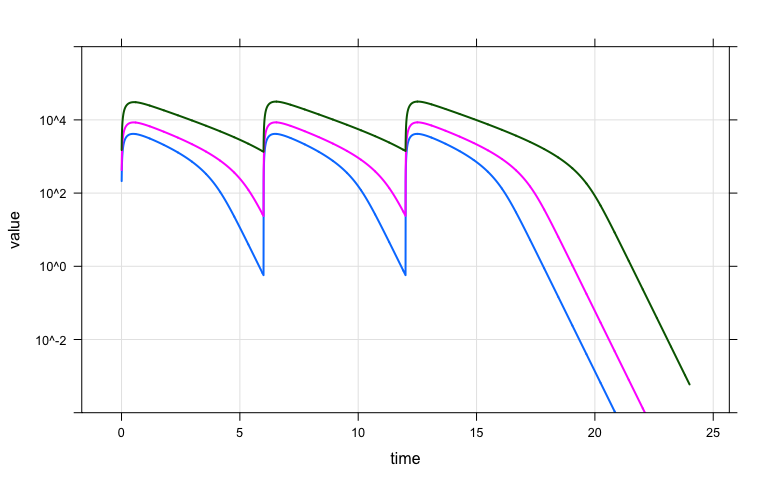
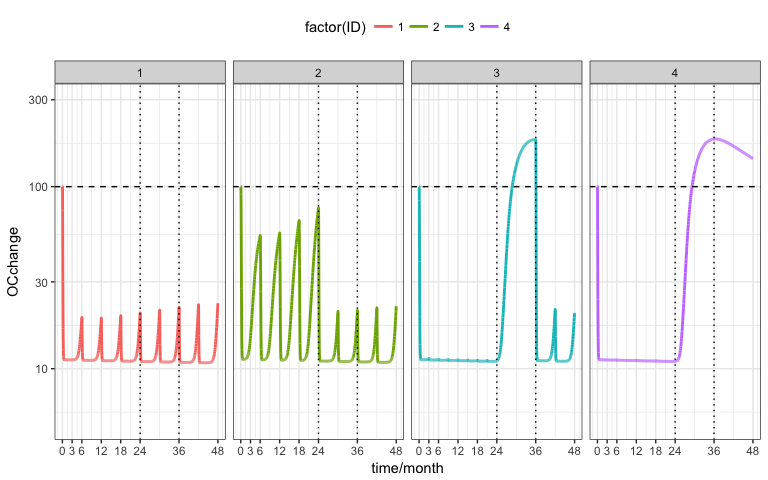

A multiscale systems model of bone health and mineral homeostasis
================
Metrum Research Group, LLC

-   [Background and Motivation](#background-and-motivation)
-   [Install from GitHub](#install-from-github)
-   [Load the Bone / Mineral model](#load-the-bone-mineral-model)
-   [Teriparatide example](#teriparatide-example)
-   [Denosumab example](#denosumab-example)
-   [Riggs and Peterson 2012](#riggs-and-peterson-2012)
    -   [Generate the dosing regimens](#generate-the-dosing-regimens)
    -   [Publication figure 3: CTx vs time](#publication-figure-3-ctx-vs-time)
    -   [Publication figure 4: BSAP vs time](#publication-figure-4-bsap-vs-time)
    -   [Publication figure 5: LS BMD vs time](#publication-figure-5-ls-bmd-vs-time)
    -   [Publication figure 6: TGF beta vs time](#publication-figure-6-tgf-beta-vs-time)

Background and Motivation
=========================

The model was originally developed to describe the bone marker changes associated with denosumab administration from a then ongoing clinical trial. Associated changes in serum calcium and PTH were also considered of interest at the time and so justified the development of a 'systems' model that included bone remodeling and bone mineral (calcium and phosphate) homeostatic mechanisms. Other therapeutics (e.g., teriparatide) and disease states (kidney failure, parathyroid-related abnormalities) were also considered at the time to further inform the parameterization and estimation of the model (Peterson and Riggs, Bone 2010).

Install from GitHub
===================

``` r
remotes::install_github("metrumresearchgroup/OpenBoneMin")
```

``` r
library(OpenBoneMin)
library(tidyverse)
```

Load the Bone / Mineral model
=============================

``` r
mod <- BoneMin()
```

Teriparatide example
====================

-   We'll give either 20 or 40 micrograms SQ daily for

``` r
out <- sim_teri(dose = c(20,40), dur = 9)

out
```

    . Model:  OpenBoneMin 
    . Dim:    4804 x 4 
    . Time:   0 to 240 
    . ID:     2 
    .      ID time PTHpm   CaC
    . [1,]  1  0.0  3.85 2.350
    . [2,]  1  0.0  3.85 2.350
    . [3,]  1  0.1 19.59 2.351
    . [4,]  1  0.2 26.29 2.352
    . [5,]  1  0.3 28.62 2.353
    . [6,]  1  0.4 28.87 2.354
    . [7,]  1  0.5 28.17 2.355
    . [8,]  1  0.6 27.04 2.356

PTH profiles for the 20 and 40 microgram doses

``` r
plot(out, PTHpm ~ time|ID, scales = "same")
```


Calcium profiles for the 20 and 40 microgram doses

``` r
plot(out, CaC~time)
```


Denosumab example
=================

``` r
out <- sim_denos(dose = c(30,60,210))

plot(out, DENCP ~.,  scales = list(y=list(log = TRUE)), 
     ylim = c(1E-4, 10E5))
```



``` r
plot(out, BMDlsDENchange ~ .)
```


Riggs and Peterson 2012
=======================

Predicting Nonlinear Changes in Bone Mineral Density Over Time Using a Multiscale Systems Pharmacology Model

Generate the dosing regimens
----------------------------

**60 mg every 6 months x 8**

``` r
month <- 24*28
regi <- function(x) factor(x,labels = c("60q6M", "14q6M", "30q3M", "210q6M"))
xscale <- scale_x_continuous(breaks = c(0,3,6,12,18,24,36,48), limits = c(0,48))
```

``` r
e1 <- ev(amt = 60, ii = 6*month, addl = 7)
```

**14 mg every 6 months x4, then 60 mg every 6 months x4**

``` r
e2 <- 
  mutate(e1, amt = 14, addl = 3) %then% 
  mutate(e1, addl = 3)
e2
```

    . Events:
    .    time cmt amt   ii addl evid
    . 1     0   1  14 4032    3    1
    . 2 16128   1  60 4032    3    1

**30 mg every 3 months for 8 doses and changed to 60 mg Q6M starting on month 36**

``` r
e3a <- ev(amt = 30, ii = 3*month, addl = 7)
e3b <- mutate(e1, addl = 1)
e3 <- seq(e3a, wait = 12*month, e3b)
e3
```

    . Events:
    .    time cmt amt   ii addl evid
    . 1     0   1  30 2016    7    1
    . 2 24192   1  60 4032    1    1

**210 mg every 6 months x4 then DC**

``` r
e4 <- mutate(e1, amt = 210, addl = 3)
e4
```

    . Events:
    .   time cmt amt   ii addl evid
    . 1    0   1 210 4032    3    1

Create one single data set from which to simulate

``` r
data <- as_data_set(e1,e2,e3,e4)

data
```

    .   ID  time cmt evid amt   ii addl
    . 1  1     0   1    1  60 4032    7
    . 2  2     0   1    1  14 4032    3
    . 3  2 16128   1    1  60 4032    3
    . 4  3     0   1    1  30 2016    7
    . 5  3 24192   1    1  60 4032    1
    . 6  4     0   1    1 210 4032    3

``` r
out <- mrgsim_df(mod, data = data, end = 48*month, delta = 0.5)
```

Publication figure 3: CTx vs time
---------------------------------

``` r
ggplot(out) + 
  geom_line(aes(x = time/month, y = OCchange, col = factor(ID)), lwd = 1) + 
  facet_grid(~ID) + geom_hline(yintercept = 100, lty = 2) +
  scale_y_continuous(trans = "log10", breaks = c(10,30,100,300), limits = c(5,300)) + 
  theme_bw() + theme(legend.position = "top") +
   geom_vline(xintercept = c(24,36), lty = 3) + xscale
```



Publication figure 4: BSAP vs time
----------------------------------

``` r
ggplot(out) + 
  geom_line(aes(x = time/(month), y = OBchange, col = factor(ID)), lwd = 1) + 
  facet_grid(~ID) + geom_hline(yintercept = 100, lty = 2) +
  scale_y_continuous(trans = "log10", breaks = c(10,30,100,300), limits = c(5,300)) +
  theme_bw() + theme(legend.position = "top") + 
  geom_vline(xintercept = c(24,36), lty = 3) + xscale
```


Publication figure 5: LS BMD vs time
------------------------------------

``` r
ggplot(out) + 
  geom_line(aes(x = time/(month), y = BMDlsDENchange, col = factor(ID)), lwd = 1) + 
  facet_grid(~ID) + 
  theme_bw() + theme(legend.position = "top") + 
  geom_vline(xintercept = c(24,36), lty = 3) + xscale
```


Publication figure 6: TGF beta vs time
--------------------------------------

``` r
out <- 
  out %>%
  group_by(ID) %>%
  mutate(TGF = 100*TGFBact/first(TGFBact)) %>% 
  ungroup

ggplot(out) + 
  geom_line(aes(x = time/(month), y = TGF, col = factor(ID)), lwd = 1) + 
  facet_grid(~ID) + 
  theme_bw() + theme(legend.position = "top") + 
  geom_vline(xintercept = c(24,36), lty = 3) + xscale +
  scale_y_continuous(breaks = c(0,25,50,75,100,150,225), limits = c(0,225)) 
```


