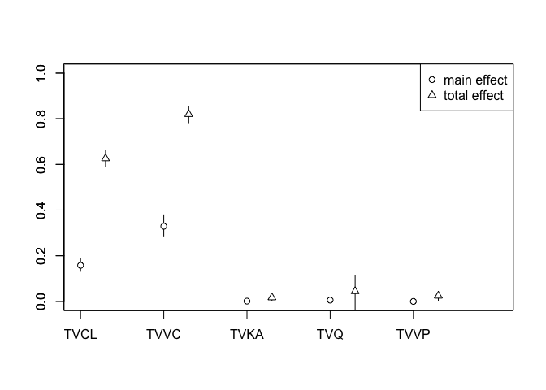
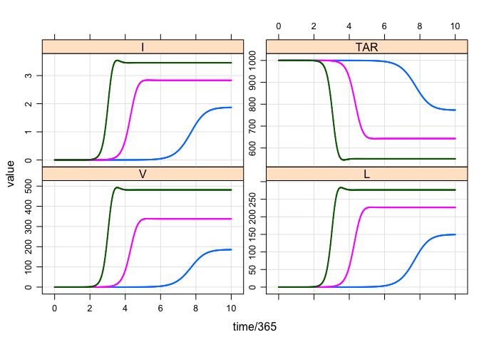
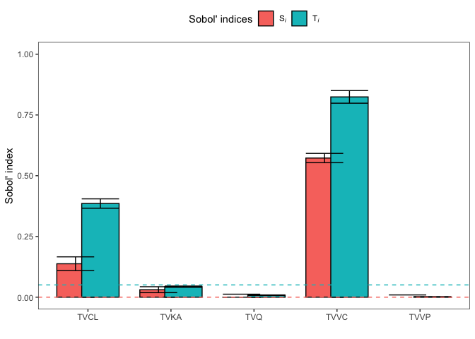

Sobol sensitivity analysis
================
Metrum Research Group, LLC

-   [Reference / About](#reference-about)
-   [Tools](#tools)
-   [The sunitinib PK model](#the-sunitinib-pk-model)
    -   [Sunitinib dosing](#sunitinib-dosing)
    -   [Generate samples](#generate-samples)
    -   [A bunch of helper functions](#a-bunch-of-helper-functions)
    -   [Run the analysis](#run-the-analysis)
        -   [First, generate the samples](#first-generate-the-samples)
        -   [Then, run `sensitivity::sobol2007`](#then-run-sensitivitysobol2007)
        -   [Results](#results)
-   [The HIV model](#the-hiv-model)
-   [Session](#session)

Reference / About
=================

Zhang XY, Trame MN, Lesko LJ, Schmidt S. **Sobol Sensitivity Analysis: A Tool to Guide the Development and Evaluation of Systems Pharmacology Models**. CPT Pharmacometrics Syst Pharmacol. 2015 Feb;4(2):69-79. doi: 10.1002/psp4.6. PubMed PMID: [27548289](https://www.ncbi.nlm.nih.gov/pubmed/27548289)

This example replicates an analysis presented in the Zhang et al. paper, but here using mrgsolve and other tools available for R.

Tools
=====

``` r
library(mrgsolve)
library(tidyverse)
library(PKPDmisc)
library(sensitivity)
```

The sunitinib PK model
======================

``` r
mod <- mread_cache("sunit", "models") %>% 
  update(end = 24, delta = 1) %>% zero_re()
```

``` r
see(mod)
```

    . 
    . Model file:  sunit.cpp 
    . $PARAM
    . TVCL = 51.8
    . TVVC = 2030
    . TVKA = 0.195
    . TVQ = 7.22
    . TVVP = 583
    . WTVC = 0.459
    . SEXCL = -0.0876
    . ASIANCL = -0.130
    . GISTCL = -0.285
    . SOLIDCL = -0.269
    . MRCCCL = -0.258
    . SEX = 0, ASIAN = 0, GIST = 0
    . SOLID = 0, MRCC = 0, WT = 76.9
    . 
    . $MAIN
    . double CL  = TVCL * (1+SEXCL*SEX) * (1+ASIANCL*ASIAN) * 
    .   (1+GISTCL*GIST) * (1+SOLIDCL*SOLID) * (1+MRCCCL*MRCC) * exp(ETA(1));
    . 
    . double V2 = TVVC*pow(WT/76.9, WTVC)*exp(ETA(2));
    . double KA = TVKA*exp(ETA(3));
    . double Q  = TVQ;
    . double V3 = TVVP;
    . 
    . $OMEGA 0.14 0.18 0.64
    . 
    . $SIGMA 0.146
    . 
    . $PKMODEL cmt = "GUT CENT, PERIPH", depot = TRUE
    . 
    . $POST
    . capture CP = (1000*CENT/V2);

Sunitinib dosing
----------------

``` r
sunev <- function(amt = 50,...) ev(amt = amt, ...)
```

Generate samples
----------------

Th function generates uniform samples from a 100 fold decrease to 100 fold increase in the nominal parameter value.

The return value is a list with two data frames that can be passed into the sobol function.

``` r
gen_samples <- function(n, l, which = names(l), 
                        factor = c(0.01,100)) {
  
  vars <- select_vars(names(l), !!(enquo(which)))
  
  l <- as.list(l)[vars]
  
  l <- map(l, .f = function(x) x*factor)

  n <- length(l)*n*2
  
  df <- as.data.frame(l)
  
  len <- length(df)
  
  X <- matrix(ncol=len, nrow=n)
  
  colnames(X) <- names(df)
  
  Y <- X
  
  for(i in seq(len)){
    r <- runif(n, df[1,i], df[2,i])
    X[,i] <- r
    r <- runif(n, df[1,i], df[2,i])
    Y[,i] <- r
  }
  
  return(list(x1 = as.data.frame(X), x2 = as.data.frame(Y)))
}
```

A bunch of helper functions
---------------------------

Simulate a batch of data. The summary is AUC for each parameter set.

``` r
batch_run <- function(x) {
  mod %>% 
    idata_set(x) %>%
    ev(sunev()) %>%
    mrgsim(obsonly = TRUE) %>% 
    group_by(ID) %>% 
    summarise(AUC = auc_partial(time,CP)) %>% 
    pull(AUC)
}
```

Run the analysis
----------------

### First, generate the samples

``` r
set.seed(88771)
samp <- gen_samples(6000, param(mod), TVCL:TVVP)

head(samp$x1)
```

    .       TVCL      TVVC      TVKA      TVQ      TVVP
    . 1 2837.253 166875.30 11.013982 108.5520 34567.952
    . 2 3490.800  14354.07 18.822180 547.8690 50545.862
    . 3 2097.291 181348.34  9.694288 427.9187 24586.856
    . 4 2341.387  26875.49 11.256036 698.8196  4460.470
    . 5 5119.695  99479.77  2.140000 666.6529 45071.206
    . 6 3456.046  19526.79  9.308946 240.5433  3260.133

``` r
dim(samp$x1)
```

    . [1] 60000     5

### Then, run `sensitivity::sobol2007`

``` r
x <- sobol2007(batch_run, X1=samp$x1, X2=samp$x2, nboot=100)
```

### Results

``` r
plot(x)
```



``` r
x
```

    . 
    . Call:
    . sobol2007(model = batch_run, X1 = samp$x1, X2 = samp$x2, nboot = 100)
    . 
    . Model runs: 420000 
    . 
    . First order indices:
    .           original          bias   std. error     min. c.i.   max. c.i.
    . TVCL  0.1601012111  2.214509e-03 0.0147719664  0.1316449251 0.189595425
    . TVVC  0.3320740078  2.876393e-03 0.0251520442  0.2830470899 0.379087675
    . TVKA  0.0010487694 -2.155859e-05 0.0006259874 -0.0003245785 0.002275195
    . TVQ   0.0051811252 -2.478164e-04 0.0019619628  0.0013627356 0.009513428
    . TVVP -0.0004045875 -1.257215e-04 0.0009964991 -0.0021085877 0.001548759
    . 
    . Total indices:
    .        original          bias  std. error    min. c.i.  max. c.i.
    . TVCL 0.62250758 -0.0034865050 0.017071677  0.592191898 0.66000962
    . TVVC 0.81936724 -0.0004663454 0.017085775  0.782400067 0.85437849
    . TVKA 0.01614792 -0.0005697163 0.005517145  0.004259271 0.02703173
    . TVQ  0.04231475 -0.0017862104 0.047789088 -0.055005315 0.11255199
    . TVVP 0.02456133  0.0004543576 0.009441657  0.003857844 0.04377317

The HIV model
=============

``` r
mod <- mread_cache("hiv", "models") %>% 
  update(end = 2000, delta = 1000, maxsteps = 50000)


out <- mrgsim(mod, 
              idata = data_frame(N = c(1000,1200,1400)),
              end = 10*365, delta = 0.1) 

plot(out, V+L+I+TAR~time/365)
```



``` r
bound <- tribble(
~name , ~lower   , ~upper,
"s"   , 1.00E-02 , 50,
"muT" , 1.00E-04 , 0.2,
"r"   , 1.00E-03 , 50,
"k1"  , 1.00E-07 , 1.00E-03,
"k2"  , 1.00E-05 , 1.00E-02,
"mub" , 1.00E-01 , 0.4,
"N"   , 1        , 2000,
"muV" , 1.00E-01 , 10
)

mksamp <- function(bounds, n) {
  x <- split(bounds,seq(nrow(bounds)))
  out <- map(x, .f = function(xx) {
    runif(n, xx$lower[1], xx$upper[1])  
  })
  names(out) <- bounds$name
  return(as_data_frame(out))
}

set.seed(10010)
x1 <- as.data.frame(mksamp(bound,4000*nrow(bound)))
x2 <- as.data.frame(mksamp(bound,4000*nrow(bound)))
```

``` r
hiv_run <- function(x) {
  
  out <- mrgsim_i(x = mod, idata = x)
  
  out %>% filter(time==2000) %>% pull(AUC)
}
```

``` r
x <- sobol2007(hiv_run, X1=x1, X2=x2, nboot=100)
```

``` r
tot <- x$T %>% mutate(type = "total order",   parameter = names(x1))

first <- x$S %>% mutate(type = "first order", parameter = names(x1))

sum <- bind_rows(tot,first) %>% mutate(ymax = original + 1.96*`std. error`)

ggplot(data = sum, aes(x = parameter, y = original, fill = type)) + 
  geom_col(position = position_dodge()) + 
  geom_errorbar(aes(ymin = original, ymax = ymax), position = position_dodge()) + 
  scale_fill_brewer(palette = "Set2", name = "") + 
  theme_bw() + ylab("Sensitivity indices") +
  theme(legend.position = "top") +
  scale_y_continuous(limits = c(0,1), breaks = seq(0,1,0.1))
```



Session
=======

``` r
devtools::session_info()
```

    .  setting  value                       
    .  version  R version 3.4.2 (2017-09-28)
    .  system   x86_64, darwin15.6.0        
    .  ui       X11                         
    .  language (EN)                        
    .  collate  en_US.UTF-8                 
    .  tz       America/New_York            
    .  date     2018-04-09                  
    . 
    .  package       * version     date       source                          
    .  assertthat      0.2.0       2017-04-11 CRAN (R 3.4.0)                  
    .  backports       1.1.2       2017-12-13 CRAN (R 3.4.2)                  
    .  base          * 3.4.2       2017-10-04 local                           
    .  bindr           0.1.1       2018-03-13 CRAN (R 3.4.4)                  
    .  bindrcpp      * 0.2         2017-06-17 cran (@0.2)                     
    .  boot            1.3-20      2017-08-06 CRAN (R 3.4.2)                  
    .  broom           0.4.3       2017-11-20 CRAN (R 3.4.2)                  
    .  cellranger      1.1.0       2016-07-27 CRAN (R 3.4.0)                  
    .  cli             1.0.0       2017-11-05 cran (@1.0.0)                   
    .  codetools       0.2-15      2016-10-05 CRAN (R 3.4.2)                  
    .  colorspace      1.3-2       2016-12-14 CRAN (R 3.4.0)                  
    .  compiler        3.4.2       2017-10-04 local                           
    .  crayon          1.3.4       2017-09-16 CRAN (R 3.4.1)                  
    .  datasets      * 3.4.2       2017-10-04 local                           
    .  devtools        1.13.5      2018-02-18 CRAN (R 3.4.2)                  
    .  digest          0.6.15      2018-01-28 CRAN (R 3.4.2)                  
    .  dplyr         * 0.7.4       2017-09-28 CRAN (R 3.4.2)                  
    .  evaluate        0.10.1      2017-06-24 CRAN (R 3.4.0)                  
    .  forcats       * 0.3.0       2018-02-19 CRAN (R 3.4.2)                  
    .  foreign         0.8-69      2017-06-22 CRAN (R 3.4.1)                  
    .  ggplot2       * 2.2.1       2016-12-30 CRAN (R 3.4.0)                  
    .  glue            1.2.0.9000  2018-01-12 Github (tidyverse/glue@1592ee1) 
    .  graphics      * 3.4.2       2017-10-04 local                           
    .  grDevices     * 3.4.2       2017-10-04 local                           
    .  grid            3.4.2       2017-10-04 local                           
    .  gtable          0.2.0       2016-02-26 CRAN (R 3.4.0)                  
    .  haven           1.1.1       2018-01-18 CRAN (R 3.4.2)                  
    .  hms             0.4.1       2018-01-24 CRAN (R 3.4.2)                  
    .  htmltools       0.3.6       2017-04-28 CRAN (R 3.4.0)                  
    .  httr            1.3.1       2017-08-20 CRAN (R 3.4.1)                  
    .  jsonlite        1.5         2017-06-01 CRAN (R 3.4.0)                  
    .  knitr           1.20        2018-02-20 CRAN (R 3.4.2)                  
    .  lattice         0.20-35     2017-03-25 CRAN (R 3.4.2)                  
    .  lazyeval        0.2.1       2017-10-29 cran (@0.2.1)                   
    .  lubridate       1.7.2       2018-02-06 CRAN (R 3.4.2)                  
    .  magrittr        1.5         2014-11-22 CRAN (R 3.4.0)                  
    .  memoise         1.1.0       2017-04-21 CRAN (R 3.4.0)                  
    .  methods       * 3.4.2       2017-10-04 local                           
    .  mnormt          1.5-5       2016-10-15 CRAN (R 3.4.0)                  
    .  modelr          0.1.1       2017-07-24 CRAN (R 3.4.1)                  
    .  mrgsolve      * 0.8.10.9014 2018-04-07 local                           
    .  munsell         0.4.3       2016-02-13 CRAN (R 3.4.0)                  
    .  nlme            3.1-131.1   2018-02-16 CRAN (R 3.4.2)                  
    .  parallel        3.4.2       2017-10-04 local                           
    .  pillar          1.2.1       2018-02-27 CRAN (R 3.4.3)                  
    .  pkgconfig       2.0.1       2017-03-21 CRAN (R 3.4.0)                  
    .  PKPDmisc      * 2.1.1       2017-12-17 CRAN (R 3.4.3)                  
    .  plyr            1.8.4       2016-06-08 CRAN (R 3.4.0)                  
    .  psych           1.7.8       2017-09-09 CRAN (R 3.4.1)                  
    .  purrr         * 0.2.4       2017-10-18 CRAN (R 3.4.2)                  
    .  R6              2.2.2       2017-06-17 CRAN (R 3.4.0)                  
    .  RColorBrewer    1.1-2       2014-12-07 CRAN (R 3.4.0)                  
    .  Rcpp            0.12.15     2018-01-20 CRAN (R 3.4.2)                  
    .  RcppArmadillo   0.8.400.0.0 2018-03-01 CRAN (R 3.4.3)                  
    .  readr         * 1.1.1       2017-05-16 cran (@1.1.1)                   
    .  readxl          1.0.0       2017-04-18 CRAN (R 3.4.0)                  
    .  reshape2        1.4.3       2017-12-11 cran (@1.4.3)                   
    .  rlang           0.2.0       2018-02-20 CRAN (R 3.4.2)                  
    .  rmarkdown       1.8         2017-11-17 cran (@1.8)                     
    .  rprojroot       1.3-2       2018-01-03 CRAN (R 3.4.2)                  
    .  rstudioapi      0.7         2017-09-07 CRAN (R 3.4.1)                  
    .  rvest           0.3.2       2016-06-17 CRAN (R 3.4.0)                  
    .  scales          0.5.0.9000  2018-02-23 Github (hadley/scales@d767915)  
    .  sensitivity   * 1.15.0      2017-09-23 CRAN (R 3.4.2)                  
    .  stats         * 3.4.2       2017-10-04 local                           
    .  stringi         1.1.6       2017-11-17 CRAN (R 3.4.2)                  
    .  stringr       * 1.3.0       2018-02-19 CRAN (R 3.4.2)                  
    .  tibble        * 1.4.2       2018-01-22 cran (@1.4.2)                   
    .  tidyr         * 0.8.0       2018-01-29 CRAN (R 3.4.2)                  
    .  tidyverse     * 1.2.1       2017-11-14 CRAN (R 3.4.2)                  
    .  tools           3.4.2       2017-10-04 local                           
    .  utils         * 3.4.2       2017-10-04 local                           
    .  withr           2.1.1.9000  2018-02-23 Github (jimhester/withr@5d05571)
    .  xml2            1.2.0       2018-01-24 CRAN (R 3.4.2)                  
    .  yaml            2.1.16      2017-12-12 CRAN (R 3.4.2)
