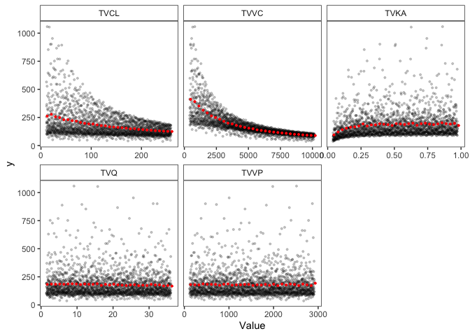
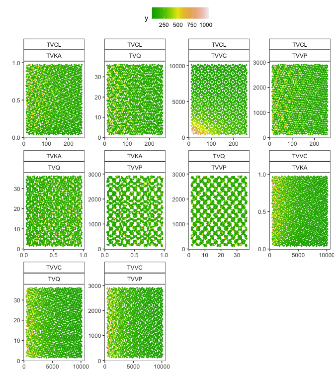

Sobol sensitivity analysis using sensobol
================
Metrum Research Group

- [Reference / About](#reference--about)
- [Introduction](#introduction)
- [Tools](#tools)
- [The sunitinib PK model](#the-sunitinib-pk-model)
  - [Sunitinib dosing](#sunitinib-dosing)
- [Generate samples](#generate-samples)
- [Run the analysis](#run-the-analysis)
  - [Simulation](#simulation)
  - [Calculate AUC](#calculate-auc)
  - [Indices](#indices)
  - [Visualize](#visualize)

# Reference / About

Zhang XY, Trame MN, Lesko LJ, Schmidt S. **Sobol Sensitivity Analysis: A
Tool to Guide the Development and Evaluation of Systems Pharmacology
Models**. CPT Pharmacometrics Syst Pharmacol. 2015 Feb;4(2):69-79. doi:
10.1002/psp4.6. PubMed PMID:
[27548289](https://www.ncbi.nlm.nih.gov/pubmed/27548289)

This example replicates an analysis presented in the Zhang et al. paper,
but here using mrgsolve and other tools available for R.

**NOTE**: This example uses the `sensobol` package to run the analysis.
This is my preferred package for global sensitivity analysis. You can
see the same analysis run with `sensitivity` here: [sobol.md](sobol.md).

# Introduction

This vignette shows you how to to Sobol sensitivity analysis, a form of
global sensitivity analysis. In this type of analysis, we look at the
relationship between variability in input parameters and variability in
model outputs when model parameters are all varied together across the
plausible parameter space. This is in contrast to local sensitivity
analysis, where parameters are perturbed one at a time by small amounts.

To do Sobol sensitivity analysis, we will need the following

1.  A model with some parameters to manipulate
2.  A (large) set of random parameter values covering a certain section
    of the plausible (or reasonable) parameter space
3.  An intervention of interest (e.g. a dose)
4.  A model output, summarized as a single value, that depends on the
    intervention and the value of the manipulated parameters (e.g. AUC
    for a PK model)
5.  Calculate sensitivity indices, which summarize the relationships
    between input parameters and model outputs
6.  Visualization or presentation of the indices

# Tools

``` r
library(mrgsolve)
library(tidyverse)
library(data.table)
library(sensobol)
library(mrgmisc)
```

Install `mrgmisc`

``` r
install.packages(
  "mrgmisc", 
  repos = "https://mpn.metworx.com/snapshots/stable/2023-10-19"
)
```

# The sunitinib PK model

``` r
mod <- mread("sunit", here("docs/models")) %>% 
  update(end = 24, delta = 0.5, outvars = "CP") %>% 
  zero_re()
```

``` r
see(mod)
```

    . 
    . Model file:  sunit.cpp 
    . $PARAM
    . TVCL = 51.8
    . TVVC = 2030
    . TVKA = 0.195
    . TVQ = 7.22
    . TVVP = 583
    . WTVC = 0.459
    . SEXCL = -0.0876
    . ASIANCL = -0.130
    . GISTCL = -0.285
    . SOLIDCL = -0.269
    . MRCCCL = -0.258
    . SEX = 0, ASIAN = 0, GIST = 0
    . SOLID = 0, MRCC = 0, WT = 76.9
    . 
    . $MAIN
    . double CL  = TVCL * (1+SEXCL*SEX) * (1+ASIANCL*ASIAN) * 
    .   (1+GISTCL*GIST) * (1+SOLIDCL*SOLID) * (1+MRCCCL*MRCC) * exp(ETA(1));
    . 
    . double V2 = TVVC*pow(WT/76.9, WTVC)*exp(ETA(2));
    . double KA = TVKA*exp(ETA(3));
    . double Q  = TVQ;
    . double V3 = TVVP;
    . 
    . $OMEGA 0.14 0.18 0.64
    . 
    . $SIGMA 0.146
    . 
    . $PKMODEL cmt = "GUT CENT, PERIPH", depot = TRUE
    . 
    . $POST
    . capture CP = (1000*CENT/V2);

## Sunitinib dosing

We are just looking at a single dose for now.

``` r
sunev <- function(amt = 50,...) ev(amt = amt, ...)
```

# Generate samples

**Number**: sample size of the base sample matrix

``` r
N <- 2 ^ 15
```

**Generate**

Generate the parameter sets.

``` r
mat <- sobol_matrices(N = N, params = c("TVCL", "TVVC", "TVKA", "TVQ", "TVVP"))
head(mat)
```

    .       TVCL  TVVC  TVKA   TVQ  TVVP
    . [1,] 0.500 0.500 0.500 0.500 0.500
    . [2,] 0.750 0.250 0.750 0.250 0.750
    . [3,] 0.250 0.750 0.250 0.750 0.250
    . [4,] 0.375 0.375 0.625 0.125 0.875
    . [5,] 0.875 0.875 0.125 0.625 0.375
    . [6,] 0.625 0.125 0.375 0.375 0.125

Take a look at the package vignette for `sensobol` for better details.
Briefly, this is a matrix with random variates for each parameter in the
sensitivity analysis. The samples are uniform between zero and one. You
will have to transform these variates to parameter values as we’ll see
in the next section.

**Transform and groom**

For this example, we will assume that all parameters have uniform
distribution between 1/5 and 5 times the current value of the parameter

``` r
params <- unlist(as.list(param(mod))[c("TVCL", "TVVC", "TVKA", "TVQ", "TVVP")])
umin <- params / 5
umax <- params * 5
umin
```

    .    TVCL    TVVC    TVKA     TVQ    TVVP 
    .  10.360 406.000   0.039   1.444 116.600

``` r
umax
```

    .      TVCL      TVVC      TVKA       TVQ      TVVP 
    .   259.000 10150.000     0.975    36.100  2915.000

After setting the minimum and maximum for each parameter, get the value
of the parameter by looking at the quantiles of the uniform distribution
(`qunif()`)

``` r
mat <- as_tibble(mat)
mat2 <- imodify(mat, ~ qunif(.x, umin[[.y]], umax[[.y]]))
mat2 <- mutate(mat2, ID = row_number())
head(mat2)
```

    . # A tibble: 6 × 6
    .    TVCL  TVVC  TVKA   TVQ  TVVP    ID
    .   <dbl> <dbl> <dbl> <dbl> <dbl> <int>
    . 1 135.   5278 0.507 18.8  1516.     1
    . 2 197.   2842 0.741 10.1  2215.     2
    . 3  72.5  7714 0.273 27.4   816.     3
    . 4 104.   4060 0.624  5.78 2565.     4
    . 5 228.   8932 0.156 23.1  1166      5
    . 6 166.   1624 0.39  14.4   466.     6

If we wanted each parameter to have log-normal distribution with 30%
coefficient of variation, we pass our uniform (0,1) variates into
`qlnorm()` instead

``` r
mat3 <- imodify(mat, ~ qlnorm(.x, log(params[[.y]]), sqrt(0.09)))
summary(mat3)
```

    .       TVCL             TVVC             TVKA              TVQ        
    .  Min.   : 15.56   Min.   : 609.8   Min.   :0.05858   Min.   : 2.169  
    .  1st Qu.: 42.31   1st Qu.:1658.2   1st Qu.:0.15928   1st Qu.: 5.897  
    .  Median : 51.80   Median :2030.0   Median :0.19500   Median : 7.220  
    .  Mean   : 54.18   Mean   :2123.4   Mean   :0.20397   Mean   : 7.552  
    .  3rd Qu.: 63.42   3rd Qu.:2485.2   3rd Qu.:0.23873   3rd Qu.: 8.839  
    .  Max.   :172.44   Max.   :6757.6   Max.   :0.64913   Max.   :24.034  
    .       TVVP       
    .  Min.   : 175.1  
    .  1st Qu.: 476.2  
    .  Median : 583.0  
    .  Mean   : 609.8  
    .  3rd Qu.: 713.8  
    .  Max.   :1940.7

``` r
params
```

    .     TVCL     TVVC     TVKA      TVQ     TVVP 
    .   51.800 2030.000    0.195    7.220  583.000

# Run the analysis

We will use the uniform parameters that we generated above.

## Simulation

Now, we have a set of parameters for the model and we can simulate PK
over 24 hours using `mrgsim_ei()`, passing in an event object and the
idata set

``` r
out <- mrgsim_ei(mod, sunev(), mat2, output = "df")
out <- as.data.table(out)
```

## Calculate AUC

``` r
y <- out[, list(auc = auc_partial(time, CP)), by = "ID"][["auc"]]
```

## Indices

``` r
ind <- sobol_indices(Y = y, N = N, params = names(params), boot = TRUE, R = 1000, first = "jansen")
ind.dummy <- sobol_dummy(Y = y, N = N, params = names(params), boot = TRUE, R = 1000)
```

``` r
ind
```

    . 
    . First-order estimator: jansen | Total-order estimator: jansen 
    . 
    . Total number of model runs: 229376 
    . 
    . Sum of first order indices: 0.7398229 
    .          original          bias    std.error       low.ci     high.ci
    .  1:  1.375835e-01 -3.054923e-05 0.0141294577  0.109920800 0.165307257
    .  2:  5.726539e-01  3.015509e-05 0.0100827253  0.552861951 0.592385508
    .  3:  3.066132e-02 -4.080888e-05 0.0064834444  0.017994814 0.043409449
    .  4:  5.038748e-05 -1.789417e-04 0.0066395046 -0.012783861 0.013242519
    .  5: -1.126222e-03 -2.169643e-04 0.0055808032 -0.011847431 0.010028916
    .  6:  3.856616e-01 -3.132605e-04 0.0096800250  0.367002381 0.404947382
    .  7:  8.242978e-01  6.082260e-04 0.0139786654  0.796291938 0.851087299
    .  8:  4.344805e-02  5.495220e-05 0.0012498384  0.040943463 0.045842740
    .  9:  8.435194e-03  1.907137e-05 0.0004945538  0.007446815 0.009385430
    . 10:  1.366155e-03 -1.355019e-06 0.0001229861  0.001126462 0.001608559
    .     sensitivity parameters
    .  1:          Si       TVCL
    .  2:          Si       TVVC
    .  3:          Si       TVKA
    .  4:          Si        TVQ
    .  5:          Si       TVVP
    .  6:          Ti       TVCL
    .  7:          Ti       TVVC
    .  8:          Ti       TVKA
    .  9:          Ti        TVQ
    . 10:          Ti       TVVP

## Visualize

First, plot uncertainty in outcome

``` r
plot_uncertainty(Y = y, N = N) + scale_x_log10()
```

<!-- -->

Now, plot indices

``` r
plot(ind, dummy = ind.dummy) + ylim(0,1)
```

<!-- -->

Plot outputs versus inputs

``` r
plot_scatter(N = 2000, data = mat2, Y = y, params = names(mat))
```

<!-- -->

``` r
plot_multiscatter(N = 2000, data = mat2, Y = y, params = names(mat))
```

<!-- -->
