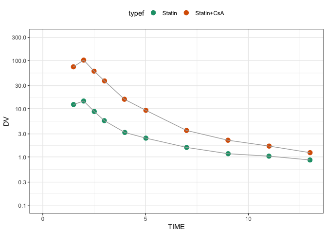

Fit parameters in PBPK model
================
Metrum Research Group, LLC

-   [Packages and setup](#packages-and-setup)
-   [Reference](#reference)
-   [Data](#data)
-   [PBPK model: pitavastatin / CsA DDI](#pbpk-model-pitavastatin-csa-ddi)
-   [Objective function](#objective-function)
    -   [Prediction function](#prediction-function)
-   [Optimize with different methods](#optimize-with-different-methods)
    -   [`minqa::newuoa`: minimization without derivatives](#minqanewuoa-minimization-without-derivatives)
    -   [`optim`: Nelder-Mead](#optim-nelder-mead)
    -   [`DEoptim`: differential evolution algorithm](#deoptim-differential-evolution-algorithm)
    -   [`GenSA`: simulated annealing](#gensa-simulated-annealing)
    -   [`hydroPSO`: particle swarm optimization](#hydropso-particle-swarm-optimization)
-   [Compare optimization methods](#compare-optimization-methods)

Packages and setup
==================

``` r
library(tidyverse)
```

    ## Warning: package 'tibble' was built under R version 3.4.3

``` r
library(mrgsolve)
library(minqa)
library(RcppDE)
library(GenSA)
library(hydroPSO)
source("functions.R")
set.seed(10101)
```

Reference
=========

**Quantitative Analyses of Hepatic OATP-Mediated Interactions Between Statins and Inhibitors Using PBPK Modeling With a Parameter Optimization Method**

-   T Yoshikado, K Yoshida, N Kotani, T Nakada, R Asaumi, K Toshimoto, K Maeda, H Kusuhara and Y Sugiyama

-   CLINICAL PHARMACOLOGY & THERAPEUTICS | VOLUME 100 NUMBER 5 | NOVEMBER 2016

-   <https://www.ncbi.nlm.nih.gov/pubmed/27170342>

Data
====

-   Example taken from figure 4a from the publication
-   Using this as example data to fit

``` r
data.file <- file.path("data", "fig4a.csv")

data <- read_csv(data.file) %>% 
  mutate(profile = NULL, 
         type=ID, 
         typef=factor(ID, labels = c("Statin", "Statin+CsA")))
```

-   The goal is to fit the pitavastatin data either alone (left) or in combination with cyclosporin administered 1 hour before the pitavastatin

``` r
ggplot(data=data,aes(time,DV)) + 
  geom_point(col="firebrick") + 
  facet_wrap(~typef) + 
  scale_y_continuous(trans="log", limits=c(0.1,300), breaks=logbr()) + 
  theme_bw()
```



-   Pick out the doses and the observations

``` r
dose <- filter(data,evid==1) %>% mutate(typef=NULL)

dose 
```

    . # A tibble: 3 x 7
    .      ID  time    DV  evid   amt   cmt  type
    .   <int> <dbl> <dbl> <int> <int> <int> <int>
    . 1     2    0.   -1.     1  2000     2     2
    . 2     2    1.   -1.     1    30     1     2
    . 3     1    1.   -1.     1    30     1     1

``` r
yobs <- filter(data,evid==0) %>% dplyr::select(DV) %>% unlist %>% unname

yobs
```

    .  [1]  73.707 101.538  59.936  37.558  15.684   9.243   3.538   2.217
    .  [9]   1.676   1.225  12.198  14.400   8.736   5.644   3.215   2.450
    . [17]   1.572   1.165   1.037   0.864

``` r
data <-  dplyr::select(data, -typef)
```

PBPK model: pitavastatin / CsA DDI
==================================

-   Check out the model / data with a quick simulation
-   We're only interested in `CP`, the pitavastatin concentration

``` r
mod <- mread("yoshikado","models") %>% 
  update(end=14, delta=0.1) %>% Req(CP) %>% obsonly()

mod %>% 
  mrgsim(data=dose,obsaug=TRUE) %>% 
  plot(CP~.,scales=list(y=list(log=TRUE)))
```


Objective function
==================

-   Least squares objective function
-   Weighted by the observations

``` r
wss <- function(dv, pred, par=NULL) {
  sum(((dv-pred)/dv)^2)
}
```

### Prediction function

-   Let's go through step by step what each line is doing for us

``` r
pred <- function(p, .data, yobs=NULL, pred=FALSE) {
  
  .par <- lapply(p,exp) %>% setNames(names(theta))
  
  .mod <- param(mod,.par)
  
  if(pred) {
    out <- mrgsim(.mod,data=.data,carry.out="type")
    return(as_data_frame(out))
  }
  
  out <- mrgsim(.mod, data=.data, obsonly=TRUE, Req="CP")
  
  return(wss(yobs,out$CP))
  
  #return(-1*sum(dnorm(log(yobs),log(out$CP),.par$sigma,log=TRUE)))
  
}
```

Optimize with different methods
===============================

`minqa::newuoa`: minimization without derivatives
-------------------------------------------------

-   These appear to be the parameters that the authors are fitting

``` r
theta <- log(c(fbCLintall = 1.2, ikiu = 1.2, 
               fbile = 0.9, ka = 0.1, ktr = 0.1))

control <- list(iprint=25)

fit1 <- newuoa(theta, pred,.data=data, yobs=yobs,control=control)
```

    . npt = 7 , n =  5 
    . rhobeg =  0.460517 , rhoend =  4.60517e-07 
    . start par. =  0.1823216 0.1823216 -0.1053605 -2.302585 -2.302585 fn =  11.02654 
    . rho:    0.046 eval:   8 fn:      7.75648 par:-0.278195 0.182322 -0.105361 -2.30259 -2.30259 
    .  25:     5.9761212: -0.384231 0.0362185 0.00414858 -1.21552 -2.32950
    .  50:     5.3742207: -0.308662 0.648543 0.292728 -0.906026 -1.96749
    . rho:   0.0046 eval:  51 fn:      5.32508 par:-0.353267 0.656077 0.284724 -0.909060 -1.96641 
    .  75:     5.3070667: -0.358181 0.455186 0.227662 -0.857222 -1.94319
    . 100:     5.2778540: -0.359674 0.129298 0.166957 -0.841412 -1.90582
    . 125:     25.545912: 0.117795 -3.03014 0.283180 -0.0213247 -0.904340
    . 150:     2.5389172: -0.374960 -3.83857 -0.198923 -0.580821 -1.81587
    . 175:     1.9130507: -0.330137 -4.31375 -0.0952221 -0.622489 -1.82890
    . 200:     1.7254888: -0.246107 -4.49996 -0.350324 -0.599323 -1.57453
    . 225:    0.77069572: -0.223189 -4.56337 -1.11774 -0.0685462 -0.603412
    . 250:    0.70781433: -0.219300 -4.47862 -1.10040 -0.0516669 -0.469470
    . 275:    0.68983396: -0.215114 -4.49761 -1.08704 -0.0473261 -0.408864
    . rho:  0.00046 eval: 298 fn:     0.686107 par:-0.205929 -4.51364 -1.06910 -0.0113708 -0.374740 
    . 300:    0.68610317: -0.205804 -4.51341 -1.06896 -0.0115079 -0.374778
    . rho:  4.6e-05 eval: 323 fn:     0.686076 par:-0.204266 -4.51446 -1.06756 -0.0111446 -0.371586 
    . 325:    0.68607656: -0.204270 -4.51448 -1.06752 -0.0111627 -0.371586
    . rho:  4.6e-06 eval: 333 fn:     0.686076 par:-0.204254 -4.51444 -1.06759 -0.0111324 -0.371565 
    . rho:  4.6e-07 eval: 344 fn:     0.686076 par:-0.204257 -4.51444 -1.06759 -0.0111321 -0.371561 
    . 350:    0.68607642: -0.204257 -4.51444 -1.06759 -0.0111325 -0.371561
    . At return
    . eval: 353 fn:     0.68607632 par: -0.204257 -4.51444 -1.06759 -0.0111321 -0.371561

``` r
fit1$par <- setNames(fit1$par,names(theta))
```

### Get some predictions to look at how the fit went

-   Predictions with the final estimates
-   Predications with the initial estimates
-   Observed data to overlay

``` r
df_pred <- pred(fit1$par,dose,pred=TRUE) %>% mutate(type = typef(type))
df_init <- pred(theta,dose,pred=TRUE) %>% mutate(type = typef(type))
df_obs <- mutate(data, type=typef(type))
```

### Plot

``` r
ggplot(data=df_pred) + 
  geom_line(data=df_init,aes(time,CP,lty="A"), col="black", lwd=0.7) +
  geom_line(aes(time,CP,lty="B"),col="darkslateblue",lwd=0.7) + 
  geom_point(data=df_obs,aes(time,DV),col="firebrick",size=2) + 
  facet_wrap(~type) + 
  scale_y_continuous(trans="log",breaks=10^seq(-4,4), 
                     limits=c(0.1,100),
                     "Pitavastatin concentration (ng/mL)") +
  scale_x_continuous(name="Time (hours)", breaks=seq(0,14,2)) +
  scale_linetype_manual(values= c(2,1),
                        labels=c("Initial estimates", "Final estimates"), name="") +
  theme(legend.position="top")  + theme_bw()
```


### The final objective function value and estimates

``` r
pred(fit1$par,.data=data,yobs=yobs)
```

    . [1] 0.6860763

``` r
exp(fit1$par)
```

    . fbCLintall       ikiu      fbile         ka        ktr 
    . 0.81525274 0.01094972 0.34383482 0.98892963 0.68965684

`optim`: Nelder-Mead
--------------------

``` r
fit1b <- optim(theta, pred,.data=data, yobs=yobs)
```

`DEoptim`: differential evolution algorithm
-------------------------------------------

"Performs evolutionary global optimization via the Differential Evolution algorithm."

``` r
lower <- rep(-6,length(theta)) %>% setNames(names(theta))
upper <- rep(4,length(theta)) %>% setNames(names(theta))

set.seed(330303)
decontrol <- DEoptim.control(NP=10*length(theta), CR=0.925, F=0.85,
                           itermax=90, storepopfrom=0)

fit2 <- DEoptim(fn=pred, lower=lower,upper=upper, control=decontrol,
                .data=data, yobs=yobs)
```

    . Iteration: 1 bestvalit: 11.392358 bestmemit:   -1.092347    0.112747   -2.966327   -4.430591   -1.337132
    . Iteration: 2 bestvalit: 7.549934 bestmemit:    0.261068   -5.726794   -3.820895   -2.211509   -2.895351
    . Iteration: 3 bestvalit: 7.549934 bestmemit:    0.261068   -5.726794   -3.820895   -2.211509   -2.895351
    . Iteration: 4 bestvalit: 6.408994 bestmemit:   -0.343694   -0.583005   -1.592347   -1.757051   -3.127639
    . Iteration: 5 bestvalit: 5.297842 bestmemit:   -0.394738   -2.675538   -0.163231   -0.669557   -2.133055
    . Iteration: 6 bestvalit: 5.297842 bestmemit:   -0.394738   -2.675538   -0.163231   -0.669557   -2.133055
    . Iteration: 7 bestvalit: 5.297842 bestmemit:   -0.394738   -2.675538   -0.163231   -0.669557   -2.133055
    . Iteration: 8 bestvalit: 5.297842 bestmemit:   -0.394738   -2.675538   -0.163231   -0.669557   -2.133055
    . Iteration: 9 bestvalit: 4.655715 bestmemit:    0.015418   -4.715815   -2.194689   -1.736370    0.127921
    . Iteration: 10 bestvalit: 4.655715 bestmemit:    0.015418   -4.715815   -2.194689   -1.736370    0.127921
    . Iteration: 11 bestvalit: 4.655715 bestmemit:    0.015418   -4.715815   -2.194689   -1.736370    0.127921
    . Iteration: 12 bestvalit: 4.655715 bestmemit:    0.015418   -4.715815   -2.194689   -1.736370    0.127921
    . Iteration: 13 bestvalit: 3.698956 bestmemit:   -0.113446   -4.128903    2.305269   -1.172718   -2.972741
    . Iteration: 14 bestvalit: 3.698956 bestmemit:   -0.113446   -4.128903    2.305269   -1.172718   -2.972741
    . Iteration: 15 bestvalit: 3.698956 bestmemit:   -0.113446   -4.128903    2.305269   -1.172718   -2.972741
    . Iteration: 16 bestvalit: 2.773631 bestmemit:    0.135085   -4.147599   -0.679893   -0.403738   -0.370148
    . Iteration: 17 bestvalit: 2.773631 bestmemit:    0.135085   -4.147599   -0.679893   -0.403738   -0.370148
    . Iteration: 18 bestvalit: 2.773631 bestmemit:    0.135085   -4.147599   -0.679893   -0.403738   -0.370148
    . Iteration: 19 bestvalit: 2.773631 bestmemit:    0.135085   -4.147599   -0.679893   -0.403738   -0.370148
    . Iteration: 20 bestvalit: 2.750931 bestmemit:   -0.096395   -4.167278   -0.129782   -0.484318   -1.579382
    . Iteration: 21 bestvalit: 2.750931 bestmemit:   -0.096395   -4.167278   -0.129782   -0.484318   -1.579382
    . Iteration: 22 bestvalit: 2.215243 bestmemit:   -0.112798   -4.622990   -1.211966   -0.719643    0.360669
    . Iteration: 23 bestvalit: 2.215243 bestmemit:   -0.112798   -4.622990   -1.211966   -0.719643    0.360669
    . Iteration: 24 bestvalit: 2.215243 bestmemit:   -0.112798   -4.622990   -1.211966   -0.719643    0.360669
    . Iteration: 25 bestvalit: 1.927958 bestmemit:   -0.242028   -4.193947   -0.977599   -0.813771   -0.862912
    . Iteration: 26 bestvalit: 1.927958 bestmemit:   -0.242028   -4.193947   -0.977599   -0.813771   -0.862912
    . Iteration: 27 bestvalit: 1.927958 bestmemit:   -0.242028   -4.193947   -0.977599   -0.813771   -0.862912
    . Iteration: 28 bestvalit: 1.927958 bestmemit:   -0.242028   -4.193947   -0.977599   -0.813771   -0.862912
    . Iteration: 29 bestvalit: 1.927958 bestmemit:   -0.242028   -4.193947   -0.977599   -0.813771   -0.862912
    . Iteration: 30 bestvalit: 1.158790 bestmemit:   -0.103973   -4.574741   -1.134102    0.094177   -0.284834
    . Iteration: 31 bestvalit: 1.158790 bestmemit:   -0.103973   -4.574741   -1.134102    0.094177   -0.284834
    . Iteration: 32 bestvalit: 1.158790 bestmemit:   -0.103973   -4.574741   -1.134102    0.094177   -0.284834
    . Iteration: 33 bestvalit: 1.158790 bestmemit:   -0.103973   -4.574741   -1.134102    0.094177   -0.284834
    . Iteration: 34 bestvalit: 0.964134 bestmemit:   -0.123688   -4.398419   -0.904964    0.109553   -0.425848
    . Iteration: 35 bestvalit: 0.964134 bestmemit:   -0.123688   -4.398419   -0.904964    0.109553   -0.425848
    . Iteration: 36 bestvalit: 0.964134 bestmemit:   -0.123688   -4.398419   -0.904964    0.109553   -0.425848
    . Iteration: 37 bestvalit: 0.964134 bestmemit:   -0.123688   -4.398419   -0.904964    0.109553   -0.425848
    . Iteration: 38 bestvalit: 0.964134 bestmemit:   -0.123688   -4.398419   -0.904964    0.109553   -0.425848
    . Iteration: 39 bestvalit: 0.751479 bestmemit:   -0.214587   -4.618232   -1.084919   -0.019831   -0.524335
    . Iteration: 40 bestvalit: 0.751479 bestmemit:   -0.214587   -4.618232   -1.084919   -0.019831   -0.524335
    . Iteration: 41 bestvalit: 0.751479 bestmemit:   -0.214587   -4.618232   -1.084919   -0.019831   -0.524335
    . Iteration: 42 bestvalit: 0.751479 bestmemit:   -0.214587   -4.618232   -1.084919   -0.019831   -0.524335
    . Iteration: 43 bestvalit: 0.751479 bestmemit:   -0.214587   -4.618232   -1.084919   -0.019831   -0.524335
    . Iteration: 44 bestvalit: 0.751479 bestmemit:   -0.214587   -4.618232   -1.084919   -0.019831   -0.524335
    . Iteration: 45 bestvalit: 0.751479 bestmemit:   -0.214587   -4.618232   -1.084919   -0.019831   -0.524335
    . Iteration: 46 bestvalit: 0.751479 bestmemit:   -0.214587   -4.618232   -1.084919   -0.019831   -0.524335
    . Iteration: 47 bestvalit: 0.751479 bestmemit:   -0.214587   -4.618232   -1.084919   -0.019831   -0.524335
    . Iteration: 48 bestvalit: 0.751479 bestmemit:   -0.214587   -4.618232   -1.084919   -0.019831   -0.524335
    . Iteration: 49 bestvalit: 0.751479 bestmemit:   -0.214587   -4.618232   -1.084919   -0.019831   -0.524335
    . Iteration: 50 bestvalit: 0.751479 bestmemit:   -0.214587   -4.618232   -1.084919   -0.019831   -0.524335
    . Iteration: 51 bestvalit: 0.714643 bestmemit:   -0.163565   -4.568315   -1.038311   -0.016670   -0.256023
    . Iteration: 52 bestvalit: 0.704039 bestmemit:   -0.215301   -4.462148   -1.069365    0.055679   -0.342349
    . Iteration: 53 bestvalit: 0.704039 bestmemit:   -0.215301   -4.462148   -1.069365    0.055679   -0.342349
    . Iteration: 54 bestvalit: 0.704039 bestmemit:   -0.215301   -4.462148   -1.069365    0.055679   -0.342349
    . Iteration: 55 bestvalit: 0.693978 bestmemit:   -0.227806   -4.462547   -1.077754   -0.007040   -0.371630
    . Iteration: 56 bestvalit: 0.693978 bestmemit:   -0.227806   -4.462547   -1.077754   -0.007040   -0.371630
    . Iteration: 57 bestvalit: 0.693978 bestmemit:   -0.227806   -4.462547   -1.077754   -0.007040   -0.371630
    . Iteration: 58 bestvalit: 0.693978 bestmemit:   -0.227806   -4.462547   -1.077754   -0.007040   -0.371630
    . Iteration: 59 bestvalit: 0.693978 bestmemit:   -0.227806   -4.462547   -1.077754   -0.007040   -0.371630
    . Iteration: 60 bestvalit: 0.693978 bestmemit:   -0.227806   -4.462547   -1.077754   -0.007040   -0.371630
    . Iteration: 61 bestvalit: 0.693978 bestmemit:   -0.227806   -4.462547   -1.077754   -0.007040   -0.371630
    . Iteration: 62 bestvalit: 0.693978 bestmemit:   -0.227806   -4.462547   -1.077754   -0.007040   -0.371630
    . Iteration: 63 bestvalit: 0.692133 bestmemit:   -0.214784   -4.511899   -1.077625    0.010479   -0.418031
    . Iteration: 64 bestvalit: 0.691258 bestmemit:   -0.221800   -4.488414   -1.085034    0.007889   -0.388160
    . Iteration: 65 bestvalit: 0.691258 bestmemit:   -0.221800   -4.488414   -1.085034    0.007889   -0.388160
    . Iteration: 66 bestvalit: 0.687985 bestmemit:   -0.204029   -4.507118   -1.075255   -0.015887   -0.387998
    . Iteration: 67 bestvalit: 0.687985 bestmemit:   -0.204029   -4.507118   -1.075255   -0.015887   -0.387998
    . Iteration: 68 bestvalit: 0.686967 bestmemit:   -0.204029   -4.521214   -1.075255   -0.015887   -0.387998
    . Iteration: 69 bestvalit: 0.686967 bestmemit:   -0.204029   -4.521214   -1.075255   -0.015887   -0.387998
    . Iteration: 70 bestvalit: 0.686967 bestmemit:   -0.204029   -4.521214   -1.075255   -0.015887   -0.387998
    . Iteration: 71 bestvalit: 0.686967 bestmemit:   -0.204029   -4.521214   -1.075255   -0.015887   -0.387998
    . Iteration: 72 bestvalit: 0.686967 bestmemit:   -0.204029   -4.521214   -1.075255   -0.015887   -0.387998
    . Iteration: 73 bestvalit: 0.686967 bestmemit:   -0.204029   -4.521214   -1.075255   -0.015887   -0.387998
    . Iteration: 74 bestvalit: 0.686967 bestmemit:   -0.204029   -4.521214   -1.075255   -0.015887   -0.387998
    . Iteration: 75 bestvalit: 0.686967 bestmemit:   -0.204029   -4.521214   -1.075255   -0.015887   -0.387998
    . Iteration: 76 bestvalit: 0.686669 bestmemit:   -0.211351   -4.505405   -1.074656   -0.019198   -0.387332
    . Iteration: 77 bestvalit: 0.686669 bestmemit:   -0.211351   -4.505405   -1.074656   -0.019198   -0.387332
    . Iteration: 78 bestvalit: 0.686669 bestmemit:   -0.211351   -4.505405   -1.074656   -0.019198   -0.387332
    . Iteration: 79 bestvalit: 0.686177 bestmemit:   -0.202406   -4.511966   -1.065281   -0.013530   -0.368120
    . Iteration: 80 bestvalit: 0.686177 bestmemit:   -0.202406   -4.511966   -1.065281   -0.013530   -0.368120
    . Iteration: 81 bestvalit: 0.686177 bestmemit:   -0.202406   -4.511966   -1.065281   -0.013530   -0.368120
    . Iteration: 82 bestvalit: 0.686177 bestmemit:   -0.202406   -4.511966   -1.065281   -0.013530   -0.368120
    . Iteration: 83 bestvalit: 0.686177 bestmemit:   -0.202406   -4.511966   -1.065281   -0.013530   -0.368120
    . Iteration: 84 bestvalit: 0.686177 bestmemit:   -0.202406   -4.511966   -1.065281   -0.013530   -0.368120
    . Iteration: 85 bestvalit: 0.686175 bestmemit:   -0.204140   -4.513662   -1.068757   -0.017382   -0.377238
    . Iteration: 86 bestvalit: 0.686175 bestmemit:   -0.204140   -4.513662   -1.068757   -0.017382   -0.377238
    . Iteration: 87 bestvalit: 0.686138 bestmemit:   -0.203138   -4.515033   -1.064251   -0.007690   -0.369566
    . Iteration: 88 bestvalit: 0.686138 bestmemit:   -0.203138   -4.515033   -1.064251   -0.007690   -0.369566
    . Iteration: 89 bestvalit: 0.686138 bestmemit:   -0.203138   -4.515033   -1.064251   -0.007690   -0.369566
    . Iteration: 90 bestvalit: 0.686138 bestmemit:   -0.203138   -4.515033   -1.064251   -0.007690   -0.369566

``` r
data.frame(initial = exp(theta),
           DE = exp(fit2$optim$bestmem),
           newuoa  = exp(fit1$par)) %>% signif(3)
```

    .            initial     DE newuoa
    . fbCLintall     1.2 0.8160 0.8150
    . ikiu           1.2 0.0109 0.0109
    . fbile          0.9 0.3450 0.3440
    . ka             0.1 0.9920 0.9890
    . ktr            0.1 0.6910 0.6900

### DA for the plot

``` r
pops <- lapply(fit2$member$storepop, as.data.frame)
hx <- bind_rows(pops)
hx <- mutate(hx, iteration=rep(1:decontrol$itermax,each=decontrol$NP))
hx <- mutate(hx, pop = rep(1:decontrol$NP, time=decontrol$itermax))
hxm <- gather(hx, variable, value, 1:5) %>% mutate(value = exp(value))
best <- as_data_frame(fit2$member$bestmemit) %>% 
  mutate(iteration = 1:decontrol$itermax)
bestm <- gather(best,variable,value,1:5) %>% mutate(value = exp(value))
```

``` r
ggplot(data=hxm) + 
  geom_line(aes(iteration,value,group=pop),col="darkslateblue") + 
  geom_line(data=bestm,aes(iteration,value),col="orange",lwd=1) + 
  scale_y_continuous(trans="log", breaks=10^seq(-4,4), name="Parameter value") + 
  facet_wrap(~variable, ncol=2, scales="free_y") 
```


`GenSA`: simulated annealing
----------------------------

``` r
set.seed(11001)

sacontrol <- list(maxit = 100, nb.stop.improvement = 20, verbose = TRUE)

fit3 <- GenSA(NULL, pred, lower, upper, .data = data, yobs = yobs, 
              control = sacontrol)
```

    . Initializing par with random data inside bounds
    . It: 1, obj value: 6.283132599
    . It: 42, obj value: 0.6860963951

`hydroPSO`: particle swarm optimization
---------------------------------------

``` r
set.seed(2202201)

fit4 <- hydroPSO(theta, fn = "pred", lower = lower, upper = upper, 
                 control = list(maxit = 100, REPORT = 5),
                 .data = data, yobs = yobs)
```

Compare optimization methods
============================

``` r
results <- list(theta, fit1$par, fit1b$par, fit2$optim$bestmem, fit3$par, fit4$par)

results <- map(results, exp)

data_frame(
  method = c("initial", "newuoa", "nelder", "RcppDE", "SA", "PSO"),
  fbCLintall = map_dbl(results, "fbCLintall"), 
  ikiu = map_dbl(results, "ikiu"), 
  fbile = map_dbl(results, "fbile"), 
  ka = map_dbl(results, "ka"), 
  ktr = map_dbl(results, "ktr")
) %>% mutate_if(is.numeric,signif,digits = 4) %>% knitr::kable()
```

| method  |  fbCLintall|     ikiu|   fbile|      ka|     ktr|
|:--------|-----------:|--------:|-------:|-------:|-------:|
| initial |      1.2000|  1.20000|  0.9000|  0.1000|  0.1000|
| newuoa  |      0.8153|  0.01095|  0.3438|  0.9889|  0.6897|
| nelder  |      0.8387|  0.01056|  0.3572|  0.9904|  0.7114|
| RcppDE  |      0.8162|  0.01094|  0.3450|  0.9923|  0.6910|
| SA      |      0.8142|  0.01097|  0.3434|  0.9889|  0.6883|
| PSO     |      0.8150|  0.01095|  0.3436|  0.9883|  0.6897|
