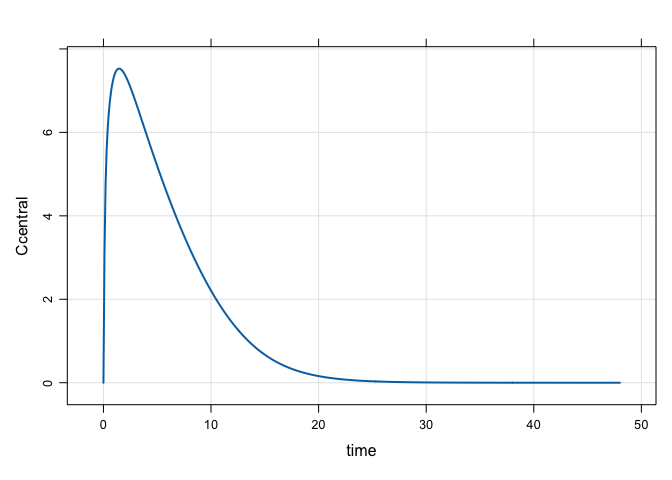

Untitled
================

-   [Rifampin / Midazolam DDI Model](#rifampin-midazolam-ddi-model)

``` r
library(mrgsolve)
library(tidyverse)
library(PKPDmisc)
theme_set(theme_bw())
theme_update(legend.position = "top")
```

Rifampin / Midazolam DDI Model
==============================

``` r
mod <- mread_cache("rifampicin_midazolam", "models", delta = 0.1)
```

-   Single dose

``` r
rif <- ev(amt = 600)
rif
```

    . Events:
    .   time cmt amt evid
    . 1    0   1 600    1

``` r
mod %>%
  ev(rif) %>% 
  Req(Ccentral) %>%
  mrgsim(end = 48) %>% 
  plot()
```


-   Multiple dose ... What's going on here?

``` r
rif <- mutate(rif, ii = 24, addl = 9)

rif
```

    . Events:
    .   time cmt amt evid ii addl
    . 1    0   1 600    1 24    9

``` r
out <- 
  mod %>%
  ev(rif) %>% 
  mrgsim(end = 240)

plot(out, Ccentral ~ time)
```



-   Anything else?

``` r
out %>% 
 mutate(DAY = 1+floor(time/24)) %>%
 group_by(DAY) %>% 
 summarise(AUC = auc_partial(time,Ccentral)) %>% 
 ungroup %>% 
 mutate(pAUC = 100*AUC/first(AUC))
```

    . # A tibble: 11 x 3
    .      DAY   AUC  pAUC
    .    <dbl> <dbl> <dbl>
    .  1    1.  58.9 100. 
    .  2    2.  50.8  86.2
    .  3    3.  46.8  79.4
    .  4    4.  44.8  76.1
    .  5    5.  43.8  74.3
    .  6    6.  43.2  73.3
    .  7    7.  42.9  72.7
    .  8    8.  42.7  72.4
    .  9    9.  42.5  72.2
    . 10   10.  42.5  72.0
    . 11   11.   0.    0.

``` r
simsm <- 
  out %>%
  as_data_frame() %>%
  gather(variable, value, c(UGT_ratio_HC5, CYP3A4_ratio_HC5))

simsm %>%
  ggplot(., aes(time, value, col = variable)) + 
  geom_line(lwd =1 ) + scale_color_brewer(palette = "Set2") 
```


