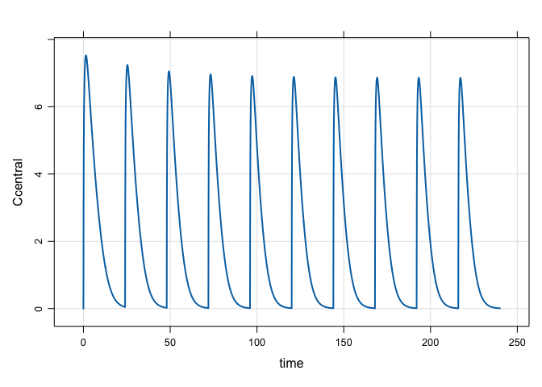

Rifampicin PBPK Model to Predict Complex DDIs
================
Metrum Research Group, LLC

-   [Reference](#reference)
-   [Rifampin PBPK](#rifampin-pbpk)
    -   [Single rifampicin dose](#single-rifampicin-dose)
    -   [Multiple rifampicin doses](#multiple-rifampicin-doses)
-   [PBPK model for rifampicin / midazolam DDI](#pbpk-model-for-rifampicin-midazolam-ddi)
    -   [Dose-response for midazolam/rifampin DDI](#dose-response-for-midazolamrifampin-ddi)

``` r
library(mrgsolve)
library(PKPDmisc)
theme_set(theme_bw())
theme_update(legend.position = "top")
```

Reference
=========

This model and vignette was derived from this publication

**Comprehensive PBPK Model of Rifampicin for Quantitative Prediction of Complex Drug-Drug Interactions: CYP3A/2C9 Induction and OATP Inhibition Effects** - Asaumi R, Toshimoto K, Tobe Y, Hashizume K, Nunoya KI, Imawaka H, Lee W, Sugiyama Y. CPT Pharmacometrics Syst Pharmacol. 2018 Jan 25. PMID: 29368402 - <https://www.ncbi.nlm.nih.gov/pubmed/29368402>

Rifampin PBPK
=============

``` r
mod <- mread_cache("rifampicin_midazolam", "models", delta = 0.1)
```

Single rifampicin dose
----------------------

``` r
rif <- ev(amt = 600)
rif
```

    . Events:
    .   time cmt amt evid
    . 1    0   1 600    1

``` r
mod %>%
  ev(rif) %>% 
  Req(Ccentral) %>%
  mrgsim(end = 48) %>% 
  plot()
```


Multiple rifampicin doses
-------------------------

``` r
rif <- mutate(rif, ii = 24, addl = 9)

rif
```

    . Events:
    .   time cmt amt evid ii addl
    . 1    0   1 600    1 24    9

``` r
out <- 
  mod %>%
  ev(rif) %>% 
  mrgsim(end = 240)
```

What is going on here?

``` r
plot(out, Ccentral ~ time)
```


Let's investigate

``` r
aucs <- 
  out %>% 
  mutate(DAY = 1+floor(time/24)) %>%
  group_by(DAY) %>% 
  summarise(AUC = auc_partial(time,Ccentral)) %>% 
  ungroup %>% 
  mutate(pAUC = 100*AUC/first(AUC)) %>%
  filter(DAY < 10)

ggplot(aucs, aes(factor(DAY),pAUC)) + 
  geom_col(alpha = 0.6) + 
  geom_hline(yintercept = 70, lty = 2, col = "firebrick") + 
  scale_y_continuous(breaks = seq(0,100,10)) + 
  ggtitle("Auto-induction of rifampicin metabolism")
```



Both `CYP3A4` and `UGT` metabolic activity increased after multiple rifampicin doses

``` r
simsm <- 
  out %>%
  as_data_frame() %>%
  gather(variable, value, c(UGT_ratio_HC5, CYP3A4_ratio_HC5))

simsm %>%
  ggplot(., aes(time/24, value, col = variable)) + 
  geom_line(lwd =1 ) + scale_color_brewer(palette = "Set2") 
```


PBPK model for rifampicin / midazolam DDI
=========================================

-   Recall that our PBPK model is really a combination of two models: one for rifampicin and one for midazolam

A single 3 mg midazolam dose

``` r
mid <- ev(amt = 3, cmt = 2)

mid
```

    . Events:
    .   time cmt amt evid
    . 1    0   2   3    1

``` r
mod %>% mrgsim_e(mid, Req = "Cmidazolam") %>% plot()
```


Now, a single 3 mg midazolam dose after 7 days of rifampin 75 mg QD

``` r
rif <- ev(amt = 75, ii = 24, addl = 6)

rif_mid <- ev_seq(rif, wait = -12, mid)

mid <- filter(rif_mid, cmt==2)

both <- as_data_set(mid, rif_mid)

both
```

    .   ID time cmt evid amt ii addl
    . 1  1  156   2    1   3  0    0
    . 2  2    0   1    1  75 24    6
    . 3  2  156   2    1   3  0    0

``` r
sims <- 
  mod %>% 
  mrgsim_d(both, Req="Cmidazolam", end = 166) %>% 
  filter_sims(time >= 156) %>% 
  mutate(ID = factor(ID, labels = c("Midazolam", "Midazolam after Rif")))


ggplot(sims, aes(time,Cmidazolam,col = factor(ID))) + 
  geom_line(lwd = 1) + 
  scale_y_continuous(trans = "log10", limits = c(0.1, 10)) +
  scale_color_brewer(palette = "Set2")
```


Midazolam exposure is reduced after rifampicin 75 mg daily x 7d

``` r
sims %>% 
  group_by(ID) %>% 
  summarise(AUC = auc_partial(time,Cmidazolam)) %>%
  mutate(percent_reduction = 100*(1-AUC/first(AUC))) %>%
  knitr::kable(digits = 2)
```

| ID                  |    AUC|  percent\_reduction|
|:--------------------|------:|-------------------:|
| Midazolam           |  24.70|                0.00|
| Midazolam after Rif |   6.84|               72.32|

Dose-response for midazolam/rifampin DDI
----------------------------------------

Make a function to wrap up the workflow for a single dose

``` r
sim_ddi <- function(rif_dose, mid_dose = 3) {
  mid <- ev(amt = mid_dose, cmt = 2)
  rif <- ev(amt = rif_dose, ii = 24, addl = 6)
  rif_mid <- ev_seq(rif, wait = -12, mid)
  
  mod %>% 
    mrgsim_e(rif_mid, Req="Cmidazolam", end = 166) %>% 
    filter_sims(time >= 156) %>%
    mutate(rif = rif_dose, mid = mid_dose)
}


out <- map_df(seq(0,600,10), .f = sim_ddi)
```

Summarize the simulations by both rifampicin dose and midazolam dose. Because we simulated the zero rifampicin dose, we get the percent reduction in AUC by dividing by the "first" auc in the series

``` r
summ <- 
  out %>%
  group_by(rif,mid) %>%
  summarise(auc = auc_partial(time,Cmidazolam)) %>%
  ungroup() %>%
  mutate(pAUC = 100*(1-auc/first(auc)))

summ
```

    . # A tibble: 61 x 4
    .      rif   mid   auc  pAUC
    .    <dbl> <dbl> <dbl> <dbl>
    .  1    0.    3. 24.7    0. 
    .  2   10.    3. 13.9   43.7
    .  3   20.    3. 11.2   54.6
    .  4   30.    3.  9.74  60.6
    .  5   40.    3.  8.76  64.5
    .  6   50.    3.  8.05  67.4
    .  7   60.    3.  7.49  69.7
    .  8   70.    3.  7.04  71.5
    .  9   80.    3.  6.66  73.0
    . 10   90.    3.  6.33  74.4
    . # ... with 51 more rows

``` r
ggplot(summ, aes(rif,pAUC)) + 
  geom_line(lwd = 1) + 
  scale_y_continuous(breaks = seq(0,100,10), limits = c(0,100),
                     name = "%Reduction in midazolam AUC after Rif x 7d") + 
  scale_x_continuous(name = "Rifampicin dose (mg)", 
                     breaks = seq(0,600,100)) + theme_bw()
```


