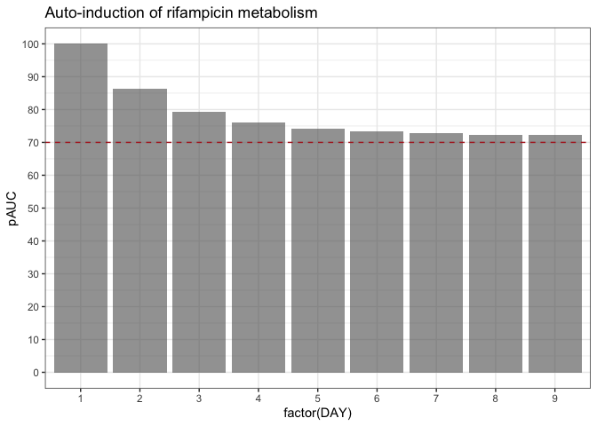
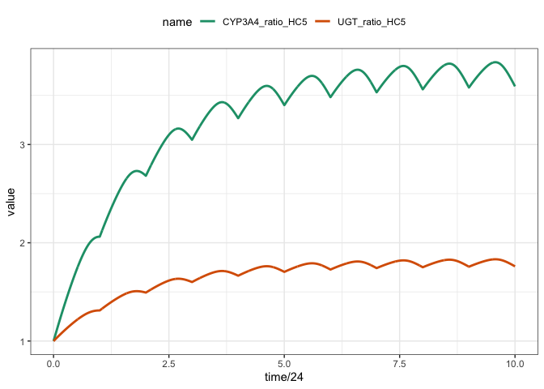

Rifampicin PBPK Model to Predict Complex DDIs
================
Metrum Research Group

- [Setup](#setup)
- [Reference](#reference)
- [Rifampin PBPK](#rifampin-pbpk)
  - [Single rifampicin dose](#single-rifampicin-dose)
  - [Multiple rifampicin doses](#multiple-rifampicin-doses)
- [PBPK model for rifampicin / midazolam
  DDI](#pbpk-model-for-rifampicin--midazolam-ddi)
  - [Dose-response for midazolam/rifampin
    DDI](#dose-response-for-midazolamrifampin-ddi)

# Setup

Install `mrgmisc`

``` r
install.packages(
  "mrgmisc", 
  repos = "https://mpn.metworx.com/snapshots/stable/2023-10-19"
)
```

``` r
library(tidyverse)
library(mrgsolve)
library(mrgmisc)
library(here)
library(knitr)
theme_set(theme_bw() + theme(legend.position = "top"))
```

# Reference

This model and vignette was derived from this publication

**Comprehensive PBPK Model of Rifampicin for Quantitative Prediction of
Complex Drug-Drug Interactions: CYP3A/2C9 Induction and OATP Inhibition
Effects** - Asaumi R, Toshimoto K, Tobe Y, Hashizume K, Nunoya KI,
Imawaka H, Lee W, Sugiyama Y. CPT Pharmacometrics Syst Pharmacol. 2018
Jan 25. PMID: 29368402 - <https://www.ncbi.nlm.nih.gov/pubmed/29368402>

# Rifampin PBPK

``` r
mod <- mread(
  "rifampicin_midazolam", 
  here("docs/models"), 
  delta = 0.1
)
```

The model has 61 and 41 compartments.

``` r
mod
```

    . 
    . 
    . ---------  source: rifampicin_midazolam.cpp  ---------
    . 
    .   project: /Users/kyleb/git...e/docs/models
    .   shared object: rifampicin_midazolam-so-121dd6b4e024f 
    . 
    .   time:          start: 0 end: 24 delta: 0.1
    .                  add: <none>
    . 
    .   compartments:  Xgutlumen Mgutlumen central Cmuscle
    .                  Cskin Cadipose Cserosa Cmucblood Cent
    .                  CHE1 CHE2 CHE3 CHE4 CHE5 CHC1 CHC2 CHC3
    .                  CHC4 CHC5 mcentral mCmuscle mCskin
    .                  ... [41]
    .   parameters:    Rdif beta gamma Km_u_uptake SFKp mSFKp
    .                  Emax_UGT_RIF EC50_u_UGT_RIF
    .                  kdeg_UGT_liver kdeg_UGT_ent
    .                  fm_UGT_liver fm_UGT_ent Emax_CYP3A4_RIF
    .                  ... [61]
    .   captures:      Ccentral mCcentral Cmidazolam [3]
    .   omega:         0x0 
    .   sigma:         0x0 
    . 
    .   solver:        atol: 1e-08 rtol: 1e-08 maxsteps: 20k
    . ------------------------------------------------------

``` r
param(mod)
```

    . 
    .  Model parameters (N=61):
    .  name              value  . name           value  . name         value  
    .  beta              0.2    | kdeg_UGT_liver 0.0158 | Qh_kg        1.24   
    .  CLrenal_kg        0.011  | Km_u_uptake    0.146  | Qmuscle_kg   0.642  
    .  EC50_u_CYP3A4_RIF 0.0526 | Kp_adipose     0.0629 | Qportal_kg   0.531  
    .  EC50_u_UGT_RIF    0.0526 | Kp_muscle      0.0947 | Qserosa_kg   0.274  
    .  Emax_CYP3A4_RIF   4.57   | Kp_serosa      0.2    | Qskin_kg     0.257  
    .  Emax_UGT_RIF      1.34   | Kp_skin        0.326  | Qvilli_kg    0.257  
    .  Fa                1      | mCLperm_gut_kg 0.151  | Rdif         0.129  
    .  fB                0.0778 | mCLrenal       0      | SFKp         6.65   
    .  fBCLint_all_kg    0.251  | mFa            1      | Vadipose_kg  0.143  
    .  fE                0.115  | mfB            0.0545 | Vcentral_kg  0.0743 
    .  Fg                0.943  | mfBCLint_kg    0.469  | Vent_kg      0.00739
    .  fH                0.0814 | mfECLint_E_kg  0.107  | VHC_kg       0.0174 
    .  fm_CYP3A4_ent     1      | mka            1.29   | VHE_kg       0.0067 
    .  fm_CYP3A4_liver   0.93   | mKp_adipose    34.4   | Vmucblood_kg 0.00099
    .  fm_UGT_ent        0.759  | mKp_liver      6.96   | Vmuscle_kg   0.429  
    .  fm_UGT_liver      0.759  | mKp_muscle     4      | Vportal_kg   0.001  
    .  gamma             0.778  | mKp_skin       20.4   | Vserosa_kg   0.00893
    .  ka                37.6   | mSFKp          0.201  | Vskin_kg     0.111  
    .  kdeg_CYP3A4_ent   0.0288 | mVcentral_kg   0.571  | WT           80     
    .  kdeg_CYP3A4_liver 0.0158 | PSdif_E_kg     0.161  | .            .      
    .  kdeg_UGT_ent      0.0288 | Qadipose_kg    0.223  | .            .

``` r
init(mod)
```

    . 
    .  Model initial conditions (N=41):
    .  name           value . name                    value . name                   
    .  Cadipose (6)   0     | CLIV2 (25)              0     | CYP3A4_ratio_HC5 (40)  
    .  Cent (9)       0     | CLIV3 (26)              0     | mCadipose (23)         
    .  central (3)    0     | CLIV4 (27)              0     | mcentral (20)          
    .  CHC1 (15)      0     | CLIV5 (28)              0     | mCmuscle (21)          
    .  CHC2 (16)      0     | Cmucblood (8)           0     | mCskin (22)            
    .  CHC3 (17)      0     | Cmuscle (4)             0     | Mgutlumen (2)          
    .  CHC4 (18)      0     | Cportal (29)            0     | UGT_ratio_ent (35)     
    .  CHC5 (19)      0     | Cserosa (7)             0     | UGT_ratio_HC1 (30)     
    .  CHE1 (10)      0     | Cskin (5)               0     | UGT_ratio_HC2 (31)     
    .  CHE2 (11)      0     | CYP3A4_ratio_ent (41)   1     | UGT_ratio_HC3 (32)     
    .  CHE3 (12)      0     | CYP3A4_ratio_HC1 (36)   1     | UGT_ratio_HC4 (33)     
    .  CHE4 (13)      0     | CYP3A4_ratio_HC2 (37)   1     | UGT_ratio_HC5 (34)     
    .  CHE5 (14)      0     | CYP3A4_ratio_HC3 (38)   1     | Xgutlumen (1)          
    .  CLIV1 (24)     0     | CYP3A4_ratio_HC4 (39)   1     | . ...                  
    .  value
    .  1    
    .  0    
    .  0    
    .  0    
    .  0    
    .  0    
    .  1    
    .  1    
    .  1    
    .  1    
    .  1    
    .  1    
    .  0    
    .  .

## Single rifampicin dose

``` r
rif <- ev(amt = 600)

rif
```

    . Events:
    .   time amt cmt evid
    . 1    0 600   1    1

``` r
mod %>%
  ev(rif) %>% 
  mrgsim(end = 48) %>% 
  plot(Ccentral ~ .)
```

<!-- -->

## Multiple rifampicin doses

``` r
rif <- mutate(rif, ii = 24, addl = 9)

rif
```

    . Events:
    .   time amt ii addl cmt evid
    . 1    0 600 24    9   1    1

``` r
out <- 
  mod %>%
  ev(rif) %>% 
  mrgsim(end = 240)
```

What is going on here?

``` r
plot(out, Ccentral ~ time)
```

<!-- -->

Let’s investigate

``` r
aucs <- 
  out %>% 
  mutate(DAY = 1+floor(time/24)) %>%
  group_by(DAY) %>% 
  summarize(auc = auc_partial(time, Ccentral), .groups = "drop") %>% 
  mutate(pAUC = 100*auc/first(auc)) %>%
  filter(DAY < 10)

ggplot(aucs, aes(factor(DAY), pAUC)) + 
  geom_col(alpha = 0.6) + 
  geom_hline(yintercept = 70, lty = 2, col = "firebrick") + 
  scale_y_continuous(breaks = seq(0,100,10)) + 
  ggtitle("Auto-induction of rifampicin metabolism")
```

<!-- -->

Both `CYP3A4` and `UGT` metabolic activity increased after multiple
rifampicin doses

``` r
simsm <- 
  out %>%
  as_tibble() %>%
  pivot_longer(cols = c(UGT_ratio_HC5, CYP3A4_ratio_HC5))

simsm %>%
  ggplot(., aes(time/24, value, col = name)) + 
  geom_line(lwd = 1 )
```

<!-- -->

# PBPK model for rifampicin / midazolam DDI

- Recall that our PBPK model is really a combination of two models: one
  for rifampicin and one for midazolam

A single 3 mg midazolam dose

``` r
mid <- ev(amt = 3, cmt = 2)

mid
```

    . Events:
    .   time amt cmt evid
    . 1    0   3   2    1

``` r
mod %>% mrgsim_e(mid, Req = "Cmidazolam") %>% plot()
```

<!-- -->

Now, a single 3 mg midazolam dose after 7 days of rifampin 75 mg QD

``` r
rif <- ev(amt = 75, ii = 24, addl = 6)

rif_mid <- ev_seq(rif, wait = -12, mid)

mid <- filter(rif_mid, cmt==2)

both <- as_data_set(mid, rif_mid)

both
```

    .   ID time cmt evid amt ii addl
    . 1  1  156   2    1   3  0    0
    . 2  2    0   1    1  75 24    6
    . 3  2  156   2    1   3  0    0

``` r
sims <- 
  mod %>% 
  mrgsim_d(both, Req = "Cmidazolam", end = 166, obsonly = TRUE) %>% 
  filter_sims(time >= 156) %>% 
  mutate(ID = factor(ID, labels = c("Midazolam", "Midazolam after Rif")))


ggplot(sims, aes(time, Cmidazolam, col = factor(ID))) + 
  geom_line(lwd = 1) + 
  scale_y_continuous(trans = "log10", limits = c(0.1, 10)) 
```

<!-- -->

Midazolam exposure is reduced after rifampicin 75 mg daily x 7d

``` r
sims %>% 
  group_by(ID) %>% 
  summarise(auc = auc_partial(time, Cmidazolam), .groups = "drop") %>% 
  mutate(percent_reduction = 100*(1-auc/first(auc))) %>%
  kable(digits = 2)
```

| ID                  |   auc | percent_reduction |
|:--------------------|------:|------------------:|
| Midazolam           | 24.70 |              0.00 |
| Midazolam after Rif |  6.84 |             72.32 |

## Dose-response for midazolam/rifampin DDI

Make a function to wrap up the workflow for a single dose

``` r
sim_ddi <- function(rif_dose, mid_dose = 3) {
  mid <- ev(amt = mid_dose, cmt = 2)
  rif <- ev(amt = rif_dose, ii = 24, addl = 6)
  rif_mid <- ev_seq(rif, wait = -12, mid)
  
  mod %>% 
    mrgsim_e(rif_mid, Req="Cmidazolam", end = 166) %>% 
    filter_sims(time >= 156) %>%
    mutate(rif = rif_dose, mid = mid_dose)
}

sim_ddi(600)
```

    . # A tibble: 102 × 5
    .       ID  time Cmidazolam   rif   mid
    .    <dbl> <dbl>      <dbl> <dbl> <dbl>
    .  1     1  156       0       600     3
    .  2     1  156       0       600     3
    .  3     1  156.      0.323   600     3
    .  4     1  156.      0.597   600     3
    .  5     1  156.      0.758   600     3
    .  6     1  156.      0.845   600     3
    .  7     1  156.      0.884   600     3
    .  8     1  157.      0.893   600     3
    .  9     1  157.      0.883   600     3
    . 10     1  157.      0.860   600     3
    . # ℹ 92 more rows

``` r
out <- map_df(seq(0,600,10), .f = sim_ddi)
```

Summarize the simulations by both rifampicin dose and midazolam dose.
Because we simulated the zero rifampicin dose, we get the percent
reduction in AUC by dividing by the “first” AUC in the series

``` r
summ <- 
  out %>%
  mutate(TIME = time, DV = Cmidazolam) %>% 
  group_by(rif,mid) %>%
  summarise(auc = auc_partial(time, Cmidazolam), .groups = "drop") %>% 
  mutate(pAUC = 100*(auc/first(auc)))

summ
```

    . # A tibble: 61 × 4
    .      rif   mid   auc  pAUC
    .    <dbl> <dbl> <dbl> <dbl>
    .  1     0     3 24.7  100  
    .  2    10     3 13.9   56.3
    .  3    20     3 11.2   45.4
    .  4    30     3  9.74  39.4
    .  5    40     3  8.76  35.5
    .  6    50     3  8.05  32.6
    .  7    60     3  7.49  30.3
    .  8    70     3  7.04  28.5
    .  9    80     3  6.66  27.0
    . 10    90     3  6.33  25.6
    . # ℹ 51 more rows

``` r
ggplot(summ, aes(rif, pAUC)) + 
  geom_line(lwd = 1) + 
  scale_y_continuous(breaks = seq(0,100,10), limits = c(0,100),
                     name = "Midazolam AUC after Rif (% of no-Rif AUC)") + 
  scale_x_continuous(name = "Rifampicin dose (mg)", 
                     breaks = seq(0,600,100)) 
```

<!-- -->
